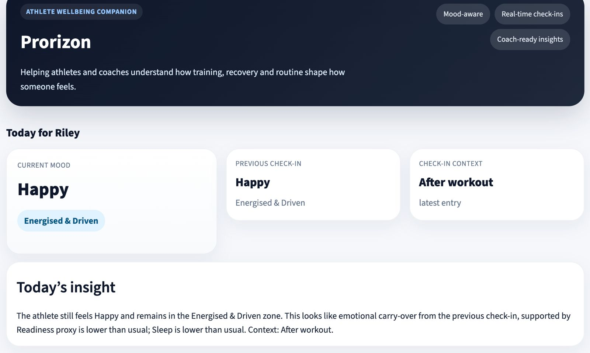
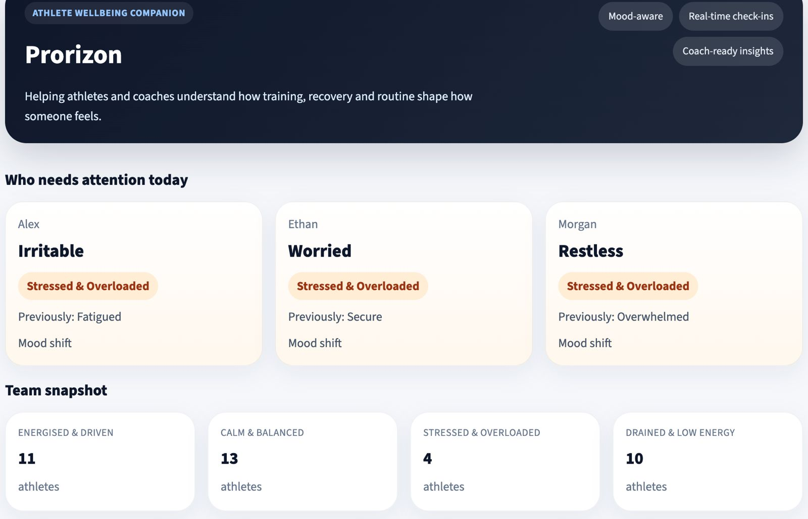
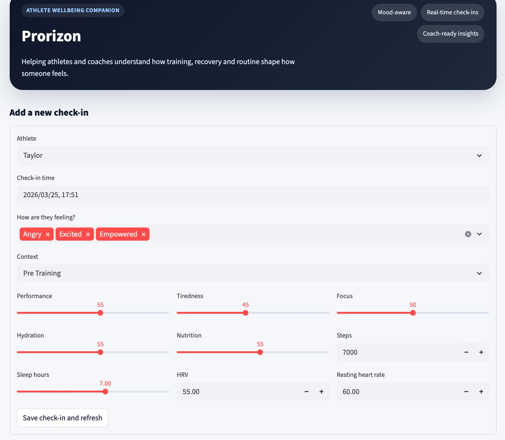
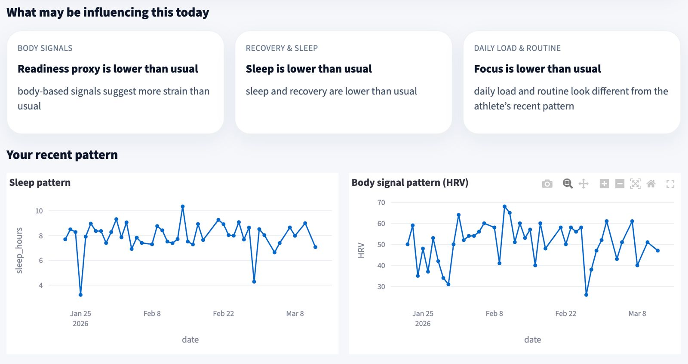
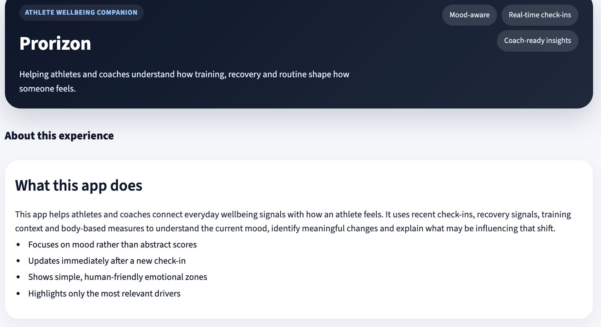

# Athlete Mood Transition & Reasoning App

## 🧠 Overview

An AI-powered athlete monitoring system that predicts mental states (e.g., fatigue, stress, recovery) using physiological data, check-ins, and contextual inputs.

The system combines global and personalized machine learning models to generate probabilistic mood predictions, detect transitions over time, and provide explainable insights for athletes and coaches.

---
## 🔑 Environment Variables
This project uses the Groq API for LLM-based features. Create a .env file in the root directory and add:
```bash
GROQ_API_KEY=your_api_key_here
GROQ_MODEL=llama-3.3-70b-versatile
```
You can obtain a Groq API key from: https://console.groq.com/

---
## ⚙️ Setup & Run Locally

### 1. Clone the repository
```bash
git clone <your-repo-url>
cd <your-repo-folder>
```

### 2. Create and activate a virtual environment
- It is recommended to use a virtual environment to avoid dependency conflicts.
- The `.venv/` folder is **not included** in this repository  
- Please create a new virtual environment locally using the setup instructions below  
- This ensures a clean and reproducible environment for running the project  
#### Mac / Linux
```bash
python3 -m venv .venv
source .venv/bin/activate
```
---

#### Windows
```bash
python -m venv .venv
.venv\Scripts\activate
```

### 3. Install dependencies
```bash
python -m pip install --upgrade pip
pip install -r requirements.txt
```

### 4. Train the models
```bash
python train.py
```
⚠️ Model artifacts are not included in the repository and will be generated during this step.

### 5. Run the application
```bash
python -m streamlit run app.py
```
Open the local URL shown in the terminal (usually http://localhost:8501).

---
## 📊 What this app does
- Predicts athlete mood using physiological and contextual data
- Uses probabilistic multi-label classification (Logistic Regression)
- Combines global + personalized models for improved accuracy
- Detects state transitions using temporal smoothing and persistence logic
- Explains predictions using grouped, human-readable drivers
- Provides both athlete-facing and coach-facing dashboards

---
## 🧱 Project Structure
```bash
src/
  data.py          # Feature engineering
  model.py         # Model training & inference
  pipeline.py      # End-to-end pipeline
  explain.py       # Explainability layer
  repository.py    # Database access

train.py           # Training script
app.py             # Streamlit dashboard
```

---
## 📂 Data & Artifacts
- Dataset is not included due to privacy and size constraints
- Model artifacts (.joblib, feature files) are generated during training
- The app uses a local SQLite database (app.db), created automatically

---
## ⚠️ Notes
- Requires Python 3.9+
- Works with tabular time-series data (no strict sequence requirement)
- Designed to handle irregular and missing data

---
## 🚀 Key Features
- Lightweight and fast (no GPU required)
- Interpretable predictions (no black-box models)
- Robust to sparse and irregular data
- Designed for real-world deployment and scalability

---
## 📸 Product Screenshots

### 🧭 Athlete Dashboard


---

### 🏋️ Coach Dashboard


---

### ➕ Add New Observation


---

### 📊 Factors Influencing Mood


---

### ⚙️ What the App Does
